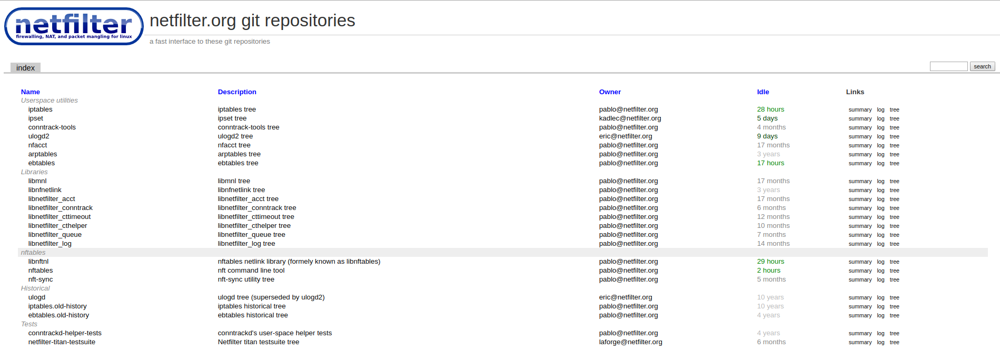

# Netfilter

La realización de la memoria de este trabajo se basa en el proyecto de software libre
Netfilter.

Netfilter es un framework de filtrado, enrutado y registro de paquetes de red además de un traductor de direciones (NAT) del kernel de Linux. Ofrece un conjunto de herramientas en espacio de usuario para trabajar con el seguimiento de paquetes además de componentes para el kernel de Linux.

Netfilter cuenta con un montón de proyectos todos de software libre. Uno de los proyectos más conocidos en Netfilter es iptables que ofrece una herramienta en espacio de usuario de Linux para configurar las reglas del firewall y enrutado de la máquina. Nftables es la herramienta que intenta reemplazar a iptables in la configuración de reglas del firewall y enrutado en linux. También ofrece librerías de desarrollo para el sistema operativo como conntrack o libmnl para facilitar el trabajo a otros desarrolladores.

Una cosa importante a destacar de Netfilter es que es un proyecto de servicios gratuitos y por tanto no tiene un ánimo lucrativo cómo organización. El proyecto existe por el esfuerzo de la comunidad, las contribuciones y el uso de las herramientas.

*Isn't it great that you can have a fully-fledged feature-rich packet* *filter, and all for free?*

*The netfilter/iptables project is a volunteer-based community effort. We can only exist because of the contributions of our users. If nobody would write any code, answer questions on* *the mailinglists, write documentation, ... the project wouldn't exist.*

_So basically, it's your choice where you want to see the project tomorrow. If you are interested in the further progress of this project: Please contribute._

La forma más obvia de ayudar en el proyecto es desarrollando, arreglando bugs o realizando mejoras sobre el software. Otra manera de contribuir puede ser realizando doncaciones escribiendo documentación o traduciéndola. Hay que tener en cuenta que cualquier donación que hagamos será decisión de la comunidad el uso de esa donación y no del que la realizó.

# Infraestructura

## Página web

Netfilter cuenta con una página web oficial donde podemos encontrar toda la documentación e información necesaria para empezar en el proyecto y entenderlo. La página web intenta ser el portal de acceso a nuevos contribuidores ya que los usuarios serán todos los usuarios que utilicen un sistema operativo linux, al tener un conjunto de herramientas y librerías estándar dentro del Kernel.

## Control de versiones

El uso de control de versiones del software es a través de git. El proyecto de netfilter tiene su propia plataforma git. El repositorio
git está plataformado sobre un servidor web y podemos acceder al git
del proyecto a través de su [enlace](https://git.netfilter.org/) cuenta también con un control de versiones sobre subversion (svn) pero
el repositorio está obsoleto.

### Resumen de un proyecto

Podríamos realizar cualquier contribución dentro de estos proyectos si accedemos por ejemplo al proyecto de iptables podemos ver el resumen total del proyecto y cuales han sido los últimos commit del proyecto.

### Registro de cambios y tabla de méritos

Dentro de netfilter existe un conjunto de desarrolladores que tienen el rol de commiter dentro de los diferentes proyectos. Hay una tabla donde se van contabilizando los commit de cada uno de ellos aunque muchos pueden ser pull request de otros desarrolladores de la lista de correo que han comiteado ellos.

## Lista de correo

Netfilter usa listas de correo para la comunicación dentro de la comunidad, existen tres tipos de listas de correo:

  * Lista de correo de release: Esta lista de correo se usa para informar a los usuarios de las nuevas versiones, cambios, nuevas funcionalidades y bugs arreglados.

  * Lista de correo de usuarios: En la lista de correo de usuarios podemos realizar preguntas respecto al uso de las herramientas o problemas en el uso de las interfaces
    de las librerías.

  * Lista de correo de desarrolladores: La lista de correo de desarrolladores se encuentran las contribuciones de desarrollo a los proyectos de netfilter. En esta lista podemos
    observar parches o issues que se proponen para parchear o agregar nuevas funcionalidades que puedan ser realizadas por otros desarrolladores de la lista.

### Normas de uso de la lista de correo

La lista de correo tiene una serie de normas que deben cumplirse para el buen funcionamiento de la comunicación dentro de la comunidad.

Subject Line
------------

Make sure that your post contains a valid subject line containing a gist of your
post rather than things like 'Help!!!', 'HELP ME PLEEEEEASE', 'Urgent Request' or 'Proposal'.

Top-posts
---------

Do not "top-post/full-quote" (reply to a message by adding text to the top of the message
and quoting the full original message), as it loses the reader and the flow of the message and can annoy other readers.

Overquoting
-----------

If you are replying to another message, quote only the portions of that message that you are
specifically responding to, and insert your comments after those quotes. Do not simply quote
back the entire message! Trim off everything apart from the most relevant lines of the original message.

In general, your reply should contain at least as much text as the amount of text you are quoting, if not more.
Never quote back dozens of lines of text and simply add a single line of text to the bottom - people will *hate* you for that!

HTML Messages
-------------

HTML is not email, and email doesn't contain HTML, so please turn HTML formatting OFF in your email client. We have
filters in place that will reject your message if your posting contains HTML. Do not use italics, colors, bold, fonts,
pictures, sounds, or other HTML elements. Please use only 7-bit characters when sending email to the lists, with proper
quoted printable encoding.

Message recycling
-----------------

Do not start a New message or thread by hitting "Reply" in your mail client and changing the subject. When you do this, you
mess up other participant's ability to read mail in a threaded fashion. When you mean to post a new message, use New, and when
you want to reply to an existing message, hit Reply.

Pseudo-legal disclaimers
------------------------

Do not attach obnoxious pseudo-legal, nonsensical disclaimers to your messages. People on open source lists do not like to be
threatened with these. If your company insists on attaching such disclaimers to messages going out to mailing lists (where,
by definition, the sender has *NO* control over who gets to see the message), then either use a webmail system, or just don't post.

Off-topic
---------

Stay on-topic for the list. This isn't a good place to discuss automobiles, politics, music, or anything that is not related to Netfilter.
Sometimes topics will diverge from the general discussion, but please try to keep it relevant to the list topic. Do not ask usage questions
in the devel list, or vice versa

Message time and date
---------------------

Please make sure the date and time on your computer is always current. When your date is set to something such as the year 2006,
messages posted by you will get sorted based on that date, which may put them outside of the related month or year they belong in.

# Licencias

Netfilter tiene licencia GPLv2, con esta licencia los desarrolladores o empresas que hagan contribuciones tienen una serie de términos de uso, liberar el software que agreguen del proyecto y vender el software que se desarrolle con el código fuente. Las licencias GPL cómo todas las licencias de software libre deben permitir las cuatro libertades del software
libre.

  * Libertad 0: Libertad de uso de programa, para cualquier propósito
  * Libertad 1: Libertad para estudiar el programa y adaptarlo a mis necesidades
  * Libertad 2: Libertad para redistribuir copias del programa.
  * Libertad 3: Libertad para mejorar el programa y distribuir las mejoras al público, para que toda la sociedad se pueda beneficiar.

El caso de las GPLv2 es una licencia copyleft se permite la redistribución y modificación, siempre y cuando dicha redistribución se realice bajo los mismos términos del
acuerdo de licencia original. Cualquier modificación o elemento original estará sujeto a la misma licencia. La licencia GPLv2 cubre únicamente las actividades de copia, redistribución
y modificación cualquier otra acción realizada está fuera del alcance de esta licencia. Las modificaciones que se hagan sobre el software deben ser marcadas con la fecha de modificación
y la persona que realizó la modificación. Copyleft además asegura que cualquier usuario que use el software pueda ejercer las cuatro libertades sobre el software modificado, copiado
o redistribuido. Las licencias libres constituyen el fundamento jurídico-filosófico del software libre.

GPLv2 es incompatible con otras licencias de software libre cómo las licencias Apache 1.0, 1.1 y 2.0 o las BSD 4Clause. Son incompatibles al tener términos de uso diferentes a las de la GPLv2 el caso de las licencias Apache es posible hacer el software modificado como privativo, la GPLv2 no permite realizar copias de uso privativo del software. Es importante entender que la utilización de una licencia u otra es importante a la hora de realizar un modelo de negocio. En el caso de netfilter no tendría sentido que se pudiera privatizar el
software ya que es una comunidad que vive de las contribuciones de los desarrolladores.

## Software firmado por los desarrolladores.

En las moficaciones del software una de las cosas que deben realizarse en la GPLv2 son las marcas de fecha de moficación y la identificación del desarrollador que realizó el parche o la mejora. Para solucionar este problema se realiza la firma del parche que se sube al control de versiones con la marca *Signed-off-by*. Los desarrolladores firman un acuerdo en la contribución en el software.

    Developer's Certificate of Origin 1.1

        By making a contribution to this project, I certify that:

        (a) The contribution was created in whole or in part by me and I
            have the right to submit it under the open source license
            indicated in the file; or

        (b) The contribution is based upon previous work that, to the best
            of my knowledge, is covered under an appropriate open source
            license and I have the right under that license to submit that
            work with modifications, whether created in whole or in part
            by me, under the same open source license (unless I am
            permitted to submit under a different license), as indicated
            in the file; or

        (c) The contribution was provided directly to me by some other
            person who certified (a), (b) or (c) and I have not modified
            it.

        (d) I understand and agree that this project and the contribution
            are public and that a record of the contribution (including all
            personal information I submit with it, including my sign-off) is
            maintained indefinitely and may be redistributed consistent with
            this project or the open source license(s) involved.

La identificación de la firma del desarrollador se realiza a través de claves GPG. El desarrollador realiza la firma con su clave privada sobre el parche y se puede comprobar su
veracidad a través de su clave pública GPG.

# Proceso de desarrollo

Cómo hemos comentado la comunidad se mueve entorno a una lista de correo. En esta lista de correo se suben las proposiciones de los desarrolladores de parches o funcionalidades nuevas
al software y son aprobadas por el _core-team_ del proyecto que son los desarrolladores que tienen permisos de escritura sobre el control de versiones. El core-team comprobará el parche y realizará la subida de código al proyecto si el parche se considera positivo para el proyecto.

Para realizar un parche se debe subir en la lista de correo

# Roles y responsabilidades

Dentro del proyecto existen una serie de roles y responsabilidades. Existen personas dentro del core-team que se dedican a la administración de la Infraestructura. El mantenimiento del servidor web o el control de versiones y la gestión de la documentación del software.
